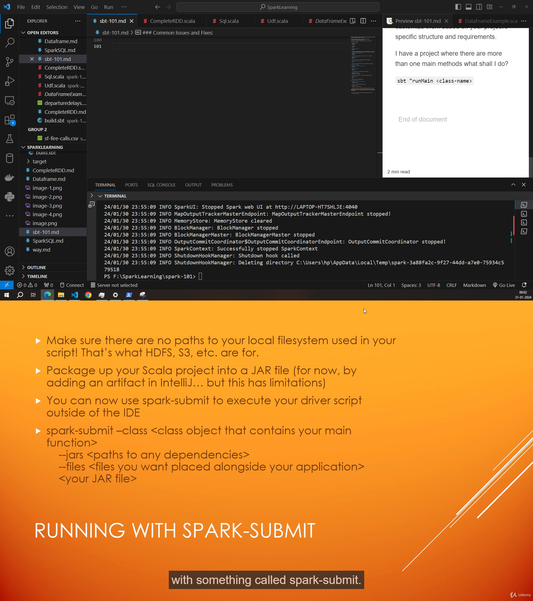
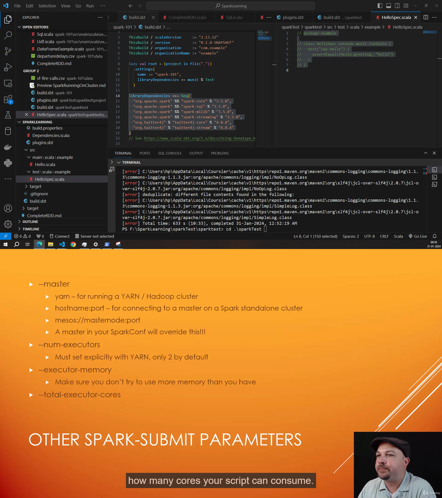
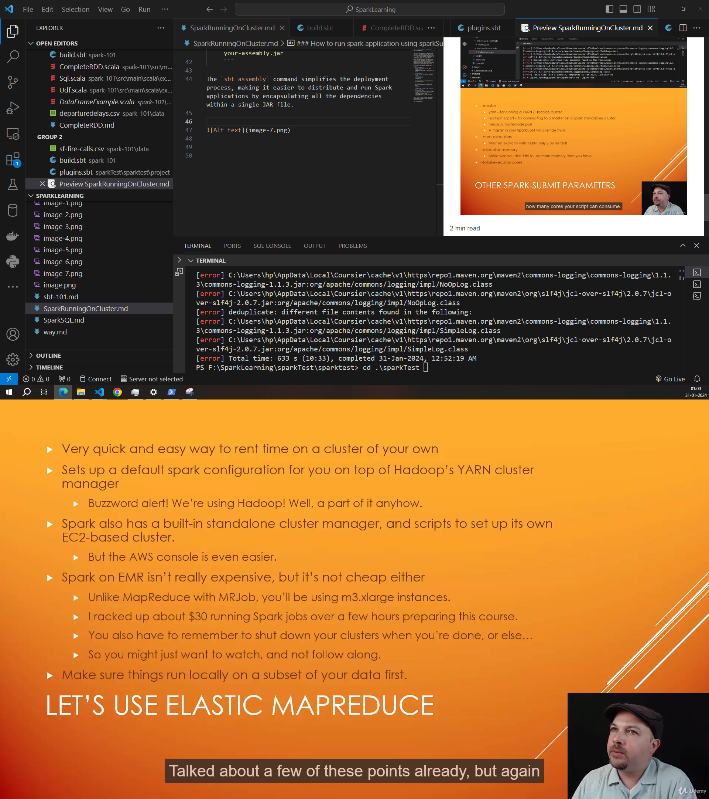
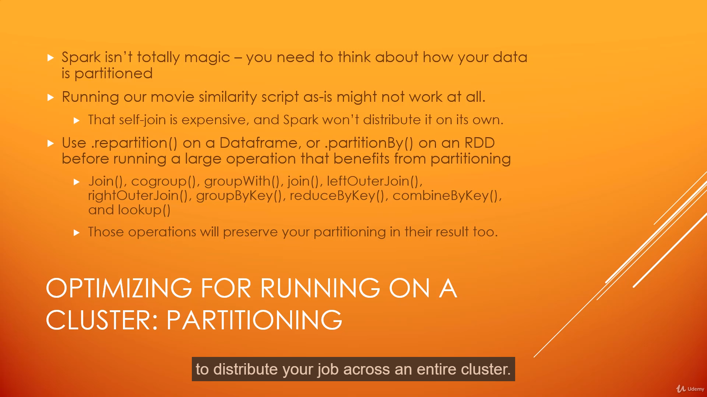

### How to run spark application using sparkSubmit




`sbt assembly` is a command used in the Simple Build Tool (sbt) to create a standalone JAR (Java Archive) file that includes all the dependencies required to run a Spark application. This assembly JAR is often referred to as a "fat" or "uber" JAR because it contains not only the application code but also all the dependent libraries (JARs) needed by the application.

When you run a Spark application, it needs access to various libraries, and managing these dependencies can sometimes be complex. The `sbt assembly` command simplifies this by bundling all the necessary dependencies into a single JAR file. This standalone JAR can be distributed and executed on a Spark cluster without worrying about missing dependencies.

Here's a general overview of how you might use `sbt assembly`:

1. **Add Assembly Plugin:**
   - In your `project/plugins.sbt` file, add the sbt-assembly plugin:
     ```scala
     addSbtPlugin("com.eed3si9n" % "sbt-assembly" % "0.15.0")
     ```

2. **Configure Assembly:**
   - In your `build.sbt` file, configure the assembly settings:
     ```scala
     // Example build.sbt
     import AssemblyKeys._

     assemblySettings

     // Specify main class for your Spark application
     mainClass in assembly := Some("com.example.YourSparkAppMainClass")
     ```

3. **Run Assembly:**
   - In your project directory, run the following command:
     ```bash
     sbt assembly
     ```
   - This will create a JAR file in the `target/scala-{version}/` directory.

4. **Use the Assembly JAR:**
   - You can now submit your Spark application using the assembled JAR, which includes all dependencies:
     ```bash
     spark-submit --class com.example.YourSparkAppMainClass target/scala-{version}/your-assembly.jar
     ```

The `sbt assembly` command simplifies the deployment process, making it easier to distribute and run Spark applications by encapsulating all the dependencies within a single JAR file.








Setting up a Spark cluster involves configuring a master node (Spark Master) and one or more worker nodes (Spark Workers). Here's a step-by-step guide using two machines, A and B, for a basic setup. We'll assume you want to run a Spark application (e.g., abc.jar) in this cluster.

### Step 1: Prerequisites

Make sure both machines (A and B) have Spark installed. You can download Spark from the official Apache Spark website: [Download Spark](https://spark.apache.org/downloads.html)

### Step 2: Configure Spark on the Master Node (Machine A)

1. **Edit `conf/spark-env.sh`:**
   Navigate to the `conf` directory inside the Spark installation folder on machine A. Copy the `spark-env.sh.template` file to create a new file named `spark-env.sh`. Edit the file to include the following:

   ```bash
   export SPARK_MASTER_HOST=<machine_A_IP>
   export SPARK_MASTER_PORT=7077
   ```

   Replace `<machine_A_IP>` with the actual IP address of machine A.

2. **Start Spark Master:**
   Run the following command on machine A:

   ```bash
   ./sbin/start-master.sh
   ```

   This will start the Spark Master.

### Step 3: Configure Spark on the Worker Node (Machine B)

1. **Edit `conf/spark-env.sh`:**
   Similar to machine A, configure the `spark-env.sh` file on machine B with the following:

   ```bash
   export SPARK_MASTER_HOST=<machine_A_IP>
   ```

   Replace `<machine_A_IP>` with the actual IP address of machine A.

2. **Start Spark Worker:**
   Run the following command on machine B:

   ```bash
   ./sbin/start-worker.sh spark://<machine_A_IP>:7077
   ```

   This will start the Spark Worker and connect it to the Spark Master on machine A.

### Step 4: Submitting a Spark Application

Assuming you have the `abc.jar` file, you can submit a Spark application to the cluster. Run the following command on any machine:

```bash
./bin/spark-submit --class your.main.class.name --master spark://<machine_A_IP>:7077 /path/to/abc.jar
```

Replace `your.main.class.name` with the main class of your Spark application, and `/path/to/abc.jar` with the actual path to your JAR file.

### Step 5: Monitor Spark Cluster

You can monitor the Spark cluster by visiting the Spark Master's web UI. Open a web browser and go to `http://<machine_A_IP>:8080`. This web UI provides information about the cluster, running applications, and worker nodes.

This is a basic setup, and in a production environment, you might need to consider security, scalability, and other configurations based on your requirements. Additionally, tools like Hadoop HDFS or a distributed file system may be used for distributed storage.

Note: Make sure your firewall settings allow communication between the machines on the specified ports.


