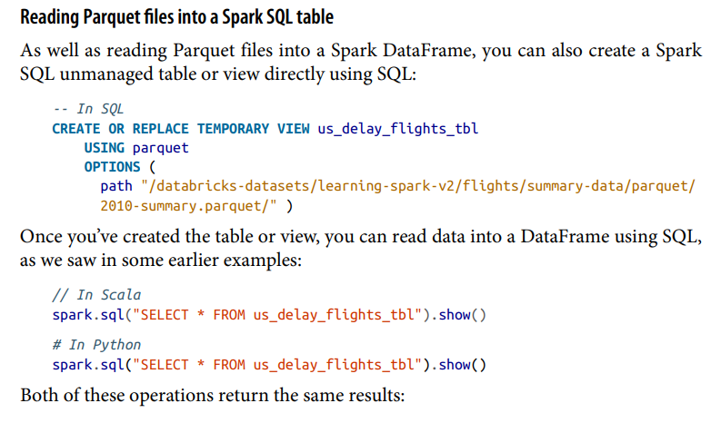

### Write SQL in spark

No, `spark.sql` in Apache Spark is not limited to working only on views. The `spark.sql` function is used to execute SQL queries directly on Spark SQL's relational engine. While you can certainly use it with views, you can also use it with DataFrames and tables.

Here are three common ways you can use `spark.sql`:

1. **On DataFrame:**
   ```scala
   val df = spark.read.csv("path/to/your/data.csv")
   df.createOrReplaceTempView("myTable")
   
   val result = spark.sql("SELECT * FROM myTable WHERE column1 > 10")
   result.show()
   ```

2. **On Table:**
   ```scala
   // Register a DataFrame as a temporary table
   val df = spark.read.csv("path/to/your/data.csv")
   df.createOrReplaceTempView("myTable")
   
   // Use spark.sql to query the table
   val result = spark.sql("SELECT * FROM myTable WHERE column1 > 10")
   result.show()
   ```

3. **On View:**
   ```scala
   // Create a view directly from a DataFrame
   val df = spark.read.csv("path/to/your/data.csv")
   df.createOrReplaceTempView("myView")
   
   // Use spark.sql to query the view
   val result = spark.sql("SELECT * FROM myView WHERE column1 > 10")
   result.show()
   ```

In each case, `spark.sql` is used to execute SQL queries on either DataFrames, tables, or views. You can perform various SQL operations, filtering, aggregations, and more using the `spark.sql` interface.

Just make sure that if you're using a view, it has been created and registered with Spark using `createOrReplaceTempView` or `createTempView`. The same SQL syntax and functionality are applicable regardless of whether you're working with DataFrames, tables, or views.


### Managed vs Unmanaged Table

In Apache Spark, managed and unmanaged tables are concepts related to managing the storage of data in the Spark Metastore, which is used to store metadata about Spark tables. These tables can be created using Spark SQL or the DataFrame API.

### Managed Tables:

1. **Definition:**
   - A managed table is a table where Spark manages both the metadata and the data.
   - When you create a managed table, Spark will take care of storing and organizing the data, and it assumes the responsibility for cleaning up the data when the table is dropped.

2. **Storage Location:**
   - Data for a managed table is stored in a default location managed by Spark in a subdirectory under the Spark warehouse directory.

3. **Cleanup on Drop:**
   - When you drop a managed table using `DROP TABLE`, Spark automatically removes both the metadata and the data associated with the table.

4. **Example:**
   ```scala
   // Creating a managed table
   spark.sql("CREATE TABLE my_managed_table (id INT, name STRING) USING parquet")
   ```

### Unmanaged Tables:

1. **Definition:**
   - An unmanaged table is a table where Spark manages only the metadata, and you are responsible for managing the data files.
   - When you create an unmanaged table, you need to specify the location where the data will be stored.

2. **Storage Location:**
   - Data for an unmanaged table is stored in a location specified by the user.

3. **No Cleanup on Drop:**
   - When you drop an unmanaged table using `DROP TABLE`, Spark only removes the metadata. The data files at the specified location are not deleted.

4. **Example:**
   ```scala
   // Creating an unmanaged table with a specified location
   spark.sql("CREATE TABLE my_unmanaged_table (id INT, name STRING) USING parquet LOCATION '/path/to/data'")
   ```

### Choosing Between Managed and Unmanaged Tables:

- **Managed Tables:**
  - Convenient when you want Spark to handle the data storage and cleanup.
  - Spark manages the default storage location, and you don't need to worry about specifying a separate location for data files.

- **Unmanaged Tables:**
  - Useful when you want more control over the storage location and need to manage the data files externally.
  - Specify the location where you want the data to be stored, which is useful for scenarios where data is shared between different Spark applications or needs to be persisted outside of Spark's default warehouse directory.

Choose between managed and unmanaged tables based on your requirements for data management, storage location, and cleanup behavior.


