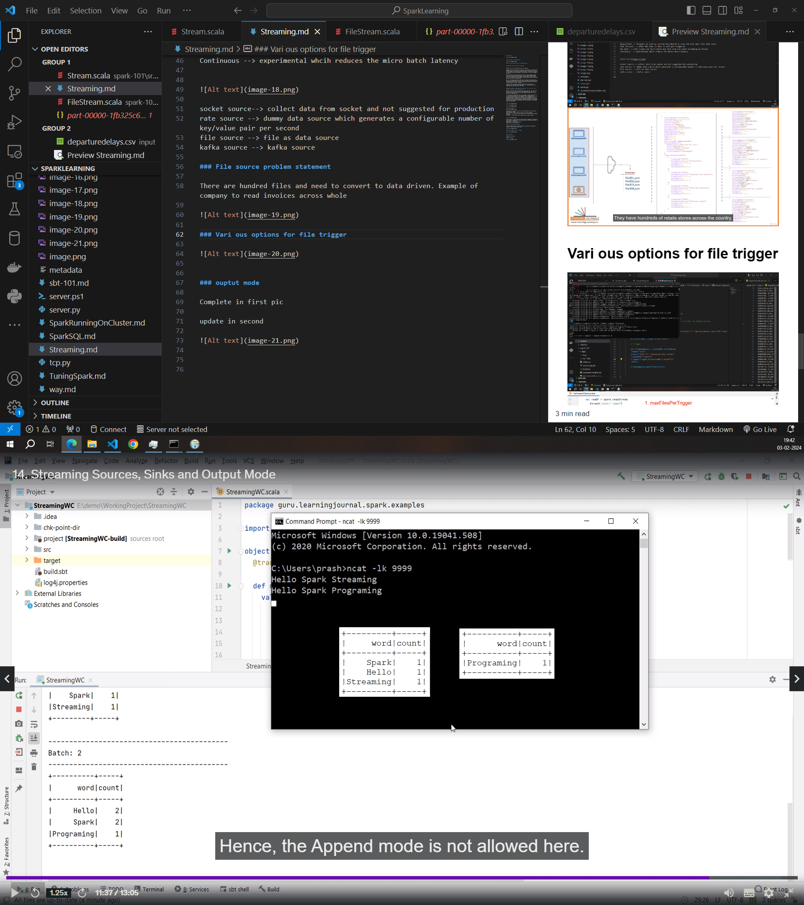
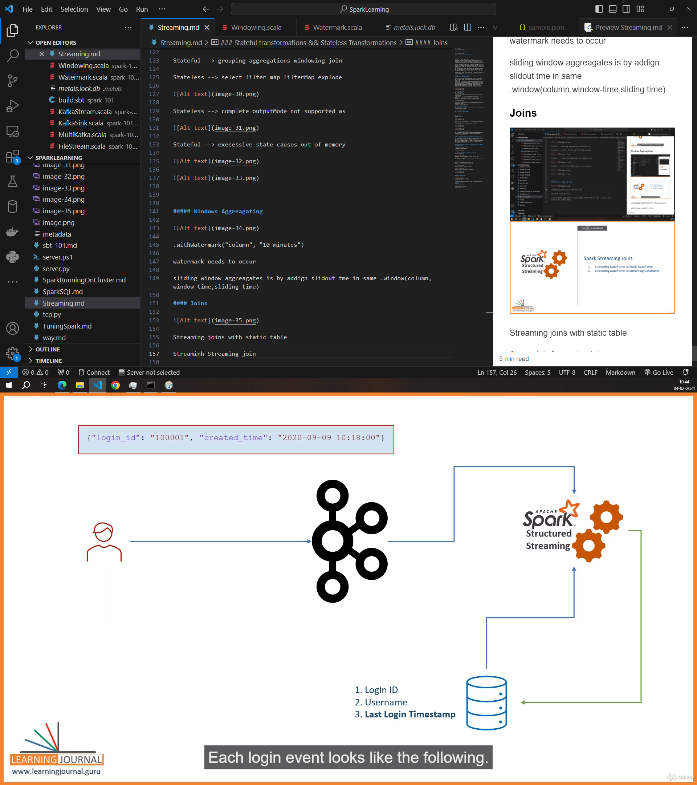

### Streaming

### Five Steps of streaming query

##### You cannot apply actons to streaming dataset 

#### Shuffle partition relation to groupBy

Alright, let's try to simplify this for a 5-year-old:

Imagine you have a big box of colorful toys, and you want to organize them based on their colors. Each color should be in its own group. Now, think of these groups as little boxes inside the big box. The process of putting all the same-colored toys together in one small box is like the "groupBy" operation.

Now, the "spark.sql.shuffle.partitions" thing is like deciding how many small boxes you want inside the big box. If you choose a bigger number, you get more small boxes, and each small box has fewer toys of the same color. If you choose a smaller number, you get fewer small boxes, but each box has more toys of the same color.

So, it's like choosing how many small boxes you want inside the big box when you are organizing your toys by color. The number you choose can make the organizing part faster or slower, depending on how many toys you have and how you want to do the organizing.

In simple terms, "groupBy" is like putting toys of the same color together, and "spark.sql.shuffle.partitions" is like deciding how many small boxes you want to use for this task.

#### Say if number of small boxes is 1 and there are 2 colours of toys then will they go into the same small box?

Exactly! If you have only one small box and two colors of toys, then both colors of toys will have to go into that single small box. It's like having a box where you mix all the colors together because there's only one space to organize them.

In the context of Spark, when you set the number of shuffle partitions to 1, it means that the data will be organized into a single group or partition during operations like "groupBy." This can happen when you have limited resources or when you want to minimize the complexity of the organization process. However, keep in mind that having only one partition may not fully utilize the parallelism capabilities of Spark, and it might not be the most efficient configuration for large datasets or distributed computing environments.

### Trigger control

Unspecified --> triggers as soon as current microbatch is over and will wait till data comes
Time Interval --> After the time is done it will get triggered
One time --> will create one micro batch and will stop the spark streaming bg thread
Continuous --> experimental whcih reduces the micro batch latency

socket source--> collect data from socket and not suggested for production
rate source --> dummy data source which generates a configurable number of key/value pair per second
file source --> file as data source
kafka source --> kafka source

### File source problem statement

There are hundred files and need to convert to data driven. Example of company to read invoices across whole

### Vari ous options for file trigger

### ouptut mode

Complete in first pic

update in second

Append mode but u can't make meaning so it is not allowed in console example

Because aggreagtions will change in future like count sum etc 

### When is the exactly once is aplicable??

Can be restarted at same checkpoint. Source must replayable. Must have same computation given the same situataons. Sink must be idempotent given dupliicqates it needs to handle it

#### What hapens when a bug is found u made changes in code and want to continue runnng from where left is it possible??

Yes --> In case some filter or some condition is changed which has nothing to do with the checkpoint information u can make it and resume

No --> In case aggregate information is changed or source or sink changed it wont allow as checkpoint location keeps track of all information about aggreagation and source sinks

#### Spark streaming keeps track of the state for example if count aggreagrate or some functon is used u can see it keeps on counting even when the data microbatch is passed

* HDFS BLOCK SIZE DEFAULT IS 128MB
* S3 DEFAULT BLOCK SIZE IS 32MB

### Stateful transformations && Stateless Transformations

We need the most recent state of the particular from state store

Example: Customer purchases and total of the value. After a day again purchase and this needs to be updated.

Stateful --> grouping aggregations windowing join

Stateless --> select filter map filterMap explode

Stateless --> complete outputMode not supported as 

Stateful --> execessive state causes out of memory

##### Windows Aggreagating

.withWatermark("column", "10 minutes") 

watermark needs to occur

sliding window aggreagates is by addign slidout tme in same .window(column,window-time,sliding time)

#### Joins

Streaming joins with static table (stateless)

Bank example

Stream to Stream is stateful join

 Streaminh Streaming join 

