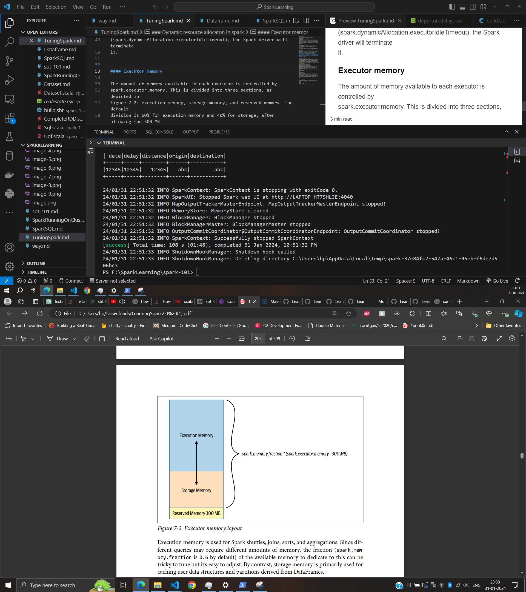
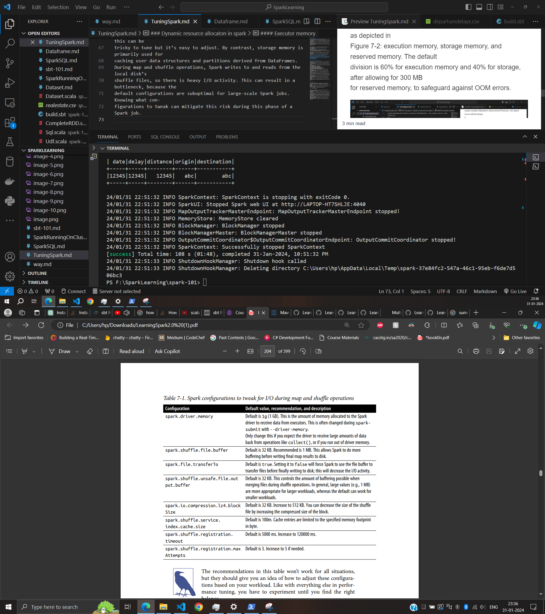

### Tuning spark

##### Viewing and Setting Apache Spark Conigurations
There are three ways you can get and set Spark properties. The first is through a set of
configuration files. In your deployment’s $SPARK_HOME directory (where you installed
Spark), there are a number of config files: conf/spark-defaults.conf.template, conf/
log4j.properties.template, and conf/spark-env.sh.template. Changing the default values
in these files and saving them without the .template suffix instructs Spark to use these
new values.

The second way is to specify Spark configurations directly in your Spark application
or on the command line when submitting the application with spark-submit, using
the --conf flag:
spark-submit --conf spark.sql.shuffle.partitions=5 --conf
"spark.executor.memory=2g" --class main.scala.chapter7.SparkConfig_7_1 jars/main.scala-chapter7_2.12-1.0.jar

The third option is through a programmatic interface via the Spark shell. As with
everything else in Spark, APIs are the primary method of interaction. Through the
SparkSession object, you can access most Spark config settings

##### Any values or flags defined in spark-defaults.conf
##### will be read first, followed by those supplied on the command line with spark-submit, and finally those set via SparkSession in the Spark application. All these
##### properties will be merged, with any duplicate properties reset in the Spark application
##### taking precedence 

### Dynamic resource allocaton in spark

To enable and configure dynamic allocation, you can use settings like the following.
Note that the numbers here are arbitrary; the appropriate settings will depend on the
nature of your workload and they should be adjusted accordingly. Some of these
configs cannot be set inside a Spark REPL, so you will have to set them
programmatically:
spark.dynamicAllocation.enabled true
spark.dynamicAllocation.minExecutors 2
spark.dynamicAllocation.schedulerBacklogTimeout 1m
spark.dynamicAllocation.maxExecutors 20
spark.dynamicAllocation.executorIdleTimeout 2min
By default spark.dynamicAllocation.enabled is set to false. When enabled with
the settings shown here, the Spark driver will request that the cluster manager create
two executors to start with, as a minimum (spark.dynamicAllocation.minExecu
tors). As the task queue backlog increases, new executors will be requested each time
the backlog timeout (spark.dynamicAllocation.schedulerBacklogTimeout) is
exceeded. In this case, whenever there are pending tasks that have not been scheduled
for over 1 minute, the driver will request that a new executor be launched to schedule
backlogged tasks, up to a maximum of 20 (spark.dynamicAllocation.maxExecu
tors). By contrast, if an executor finishes a task and is idle for 2 minutes
(spark.dynamicAllocation.executorIdleTimeout), the Spark driver will terminate
it.

#### Executor memory

The amount of memory available to each executor is controlled by
spark.executor.memory. This is divided into three sections, as depicted in
Figure 7-2: execution memory, storage memory, and reserved memory. The default
division is 60% for execution memory and 40% for storage, after allowing for 300 MB
for reserved memory, to safeguard against OOM errors. 

Execution memory is used for Spark shuffles, joins, sorts, and aggregations. Since dif‐
ferent queries may require different amounts of memory, the fraction (spark.mem
ory.fraction is 0.6 by default) of the available memory to dedicate to this can be
tricky to tune but it’s easy to adjust. By contrast, storage memory is primarily used for
caching user data structures and partitions derived from DataFrames.
During map and shuffle operations, Spark writes to and reads from the local disk’s
shuffle files, so there is heavy I/O activity. This can result in a bottleneck, because the
default configurations are suboptimal for large-scale Spark jobs. Knowing what con‐
figurations to tweak can mitigate this risk during this phase of a Spark job.

